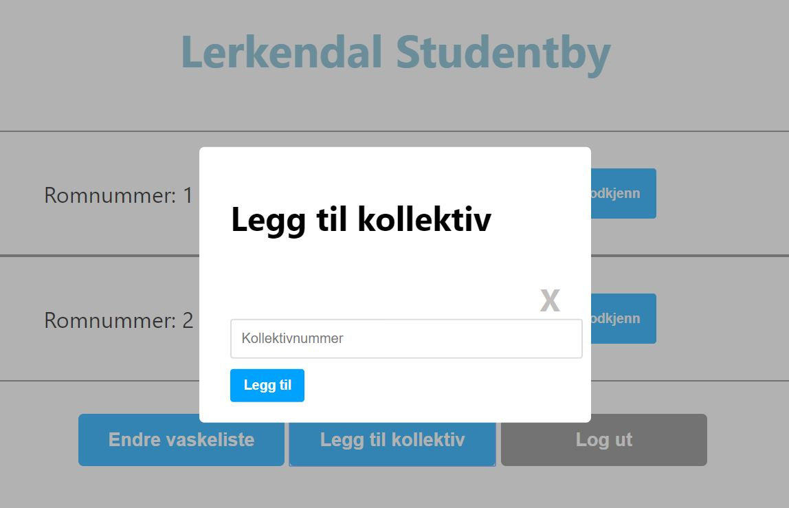
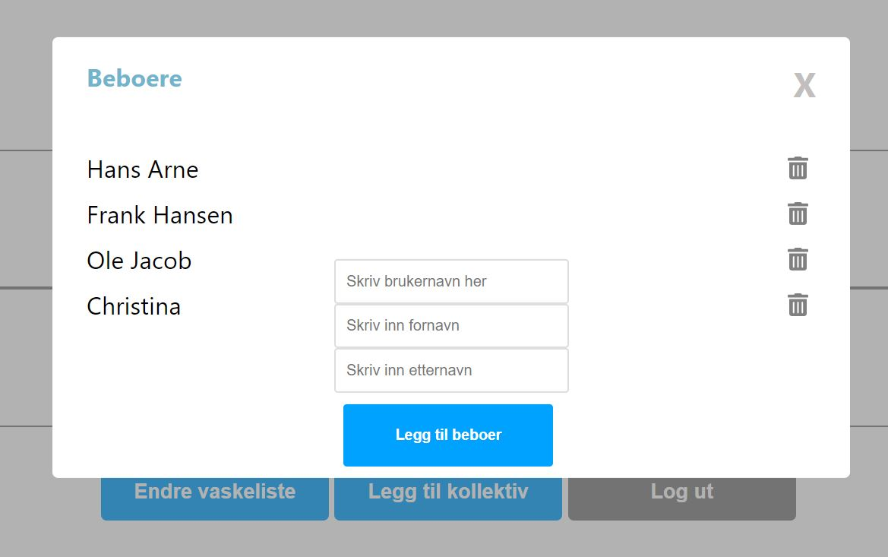
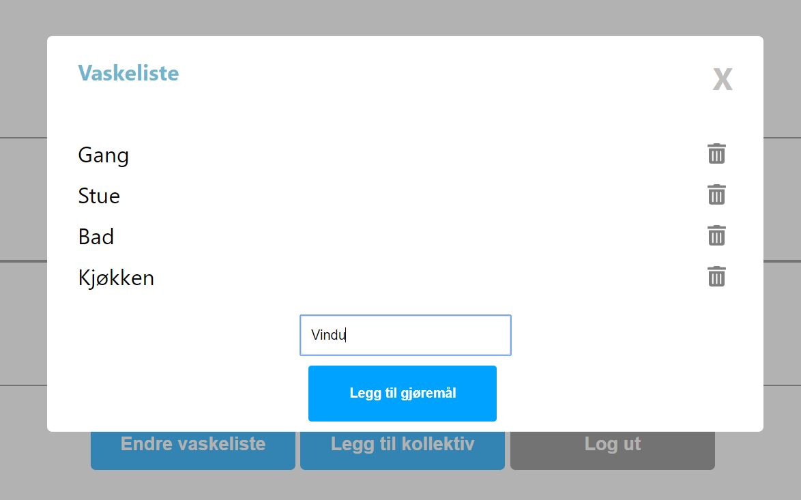

# SiF hybelvask
Enkleste vei til din vaskeliste!

Gå til siden [her](https://sifvaskeliste.netlify.com/)

Legg inn pipeline status og coverage report?

## Motivasjon
Det kan være vanskelig å holde oversikt over renholdet i en stor studentby. Det gjelder både for beboere og adminstrasjonen. De manuelle papirarkene blir glemt eller forsvinner, og det er vanskelig å holde oversikt. Studentsamskipnaden i Fredrikstad er i sterk vekst, og trengte sårt en ny og bedre løsning! Vår intuive nettside, skal gjøre det lett for alle involverte å holde oversikt over vaskelisten. Ingen flere unnskyldninger for sluntre unna en god vask!


## Build Status
Legg inn pipeline status


## Kodestandard
Prettier er ble brukt til å formatere koden, og ESlint ble brukt som linter. [Har dette skjedd?]

## Screenshots
#### Forside


#### Admin View
Når man logger inn som admin møter man denne siden:


#### Legge til kollektiv
Som administrator kan man legge til kollektiv, og gi dette et nummer


#### Legge til kollektivmedlemmer
En admin kan legge til kollektivmedlemmer, med brukernavn, fornavn og etternavn


#### Endre vaskelisten
I vinduet kan administratoren legge til eller fjerne oppgaver i vaskelisten



## Rammeverk
- React
- Node.js med Express

## Database
- MongoDB

## Egenskaper
Vaskesystemet er intuivt fra første møte, og har et enkelt og effektivt design. Alle funksjonene er lett tilgjengelig fra forsidene som møter beboere og administratorer.

## Eksempelkode

Lim gjerne inn noe annen kode

```java
const addCleaningItem = (newCleaningItem) => {
       newCleaningList.push(newCleaningItem);
       axios.put(`http://localhost:5000/api/vaskeliste/${cleaningList._id}`,
           {
               "liste": newCleaningList
           }
       )
           .then(response => {
               console.log(response)
           })
           .catch((error) => {
               console.log(error);
           })
   };

```

## Installasjon
**For å kjøre prosjektet**
- Installer [Node.js](https://nodejs.org)
- Åpne terminal og gå til en mappe du vil lagre prosjektet. F.eks.: `cd Desktop/minMappe`
- Skriv inn dette i terminalen for å klone prosjektet: `git clone https://gitlab.stud.idi.ntnu.no/tdt4140-2020/48.git`
- Skriv `cd 48` for å gå inn i prosjektmappa, og `npm install` for å installere alle nødvendige komponenter
- Åpne en ny fane av terminalen slik at du har 2 faner åpne
- I fane 1 gå inn i server-mappa: `cd server` og skriv `node index.js` for å kjøre backend
- I fane 2 gå inn i klient-mappa: `cd client` og skriv `npm start` for å kjøre frontend

**Innloggingsinformasjon**
*  Kollektiv
   - Brukernavn: `testUser`
   - Passord: `12345`
*  Admin
   - Brukernavn: `fredrik`
   - Passord: `12345`

**Alertnativt**
*  Gå inn på [https://sifvaskeliste.netlify.com/](https://sifvaskeliste.netlify.com/)

## Testing
[![coverage report]]

Kan noen skrive noe inn her?

## Hvordan anvende produktet?
Se [wiki](https://gitlab.stud.idi.ntnu.no/tdt4140-2020/48/-/wikis/Brukermanual) for detaljert brukermanual om hvordan man anvender produktet


## Team
- Edvard Dønvold Sjøborg
- Fredrik Bjørnland
- Oline Vikøren Zachariassen
- Oscar Bergan
- Sandra Helen Husnes
- Johanne Øderud Vatne


## Lisens
[MIT License](LICENSE)
