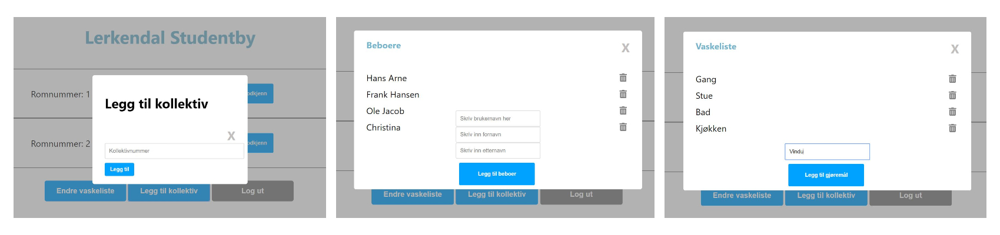

# SiF hybelvask

Den enkleste vei til din vaskeliste!

Gå til siden [her](https://sifvaskeliste.netlify.com/)

Legg inn pipeline status og coverage report?

## Motivasjon
Det kan være vanskelig å holde oversikt over renholdet i en stor studentby. Det gjelder både for beboere og adminstrasjonen. De manuelle papirarkene blir glemt eller forsvinner, og det er vanskelig å holde oversikt. Studentsamskipnaden i Fredrikstad er i sterk vekst, og trengte sårt en ny og bedre løsning! Vår intuive nettside, skal gjøre det lett for alle involverte å holde oversikt over vaskelisten. Ingen flere unnskyldninger for sluntre unna en god vask!


## Build Status

[](https://gitlab.stud.idi.ntnu.no/tdt4140-2020/48/-/commits/master)
[](https://gitlab.stud.idi.ntnu.no/tdt4140-2020/48/-/commits/master)

## Kodestandard
Prettier er ble brukt til å formatere koden, og ESlint ble brukt som linter.

[](https://github.com/prettier/prettier-vscode#badge)
[](https://standardjs.com)

## Screenshots
#### Forside


#### Kollektiv View
Som beboer kan man logge inn, se sitt kollektiv, vaskelisten, og huke av utførte oppgaver


#### Admin View
Når man logger inn som admin møter man denne siden:


Som administrator kan man administrere kollektivene, legge til nye, endre medlemmene, og redigere vaskelisten



## Teknologi og rammeverk
- Brukergrensesnittet er bygget med ([React](https://reactjs.org/))
- ([Node.js](https://nodejs.org/en/)) med ([Express](https://expressjs.com/)) brukes til backend
- ([MongoDB](https://www.mongodb.com/)) brukes som databaseprogram

## Egenskaper

De viktigste funksjonene i systemet lar
- En kollektiv-beboer logge seg inn å få oversikt over vaskelista i sitt kollektiv, og krysse av plikter som er utført
- En administrator kan logge seg inn og administrere kollektivene og vaskelistene i sine studentbyer, og godkjenne vaskejobben. 

**Hvorfor skiller vi oss ut?** SiFs vaskeside er intuivt fra første møte, og har et enkelt og effektivt design. Alle funksjonene er lett tilgjengelig fra forsidene som møter beboere og administratorer.

## Eksempelkode

```java
const addCleaningItem = (newCleaningItem) => {
       newCleaningList.push(newCleaningItem);
       axios.put(`http://localhost:5000/api/vaskeliste/${cleaningList._id}`,
           {
               "liste": newCleaningList
           }
       )
           .then(response => {
               console.log(response)
           })
           .catch((error) => {
               console.log(error);
           })
   };

```
## Installasjon
**For å kjøre prosjektet**
- Installer [Node.js](https://nodejs.org)
- Åpne terminal og gå til en mappe du vil lagre prosjektet. F.eks.: `cd Desktop/minMappe`
- Skriv inn dette i terminalen for å klone prosjektet: `git clone https://gitlab.stud.idi.ntnu.no/tdt4140-2020/48.git`
- Skriv `cd 48` for å gå inn i prosjektmappa, og `npm install` for å installere alle nødvendige komponenter
- Åpne en ny fane av terminalen slik at du har 2 faner åpne
- I fane 1 gå inn i server-mappa: `cd server` og skriv `node index.js` for å kjøre backend
- I fane 2 gå inn i klient-mappa: `cd client` og skriv `npm start` for å kjøre frontend

**Innloggingsinformasjon**
*  Kollektiv
   - Brukernavn: `testUser`
   - Passord: `12345`
*  Admin
   - Brukernavn: `fredrik`
   - Passord: `12345`


**Alternativt**
*  Gå inn på [https://sifvaskeliste.netlify.com/](https://sifvaskeliste.netlify.com/)

## Testing
[![coverage report]]

- Naviger til klient-mappa: `cd client`
- Skriv inn kommandoen `npm test`

## Hvordan anvende produktet?
Se [wiki](https://gitlab.stud.idi.ntnu.no/tdt4140-2020/48/-/wikis/Brukermanual) for detaljert brukermanual om hvordan man anvender produktet


## Team
- Edvard Dønvold Sjøborg
- Fredrik Bjørnland
- Oline Vikøren Zachariassen
- Oscar Bergan
- Sandra Helen Husnes
- Johanne Øderud Vatne


## Lisens
[MIT License](LICENSE)
